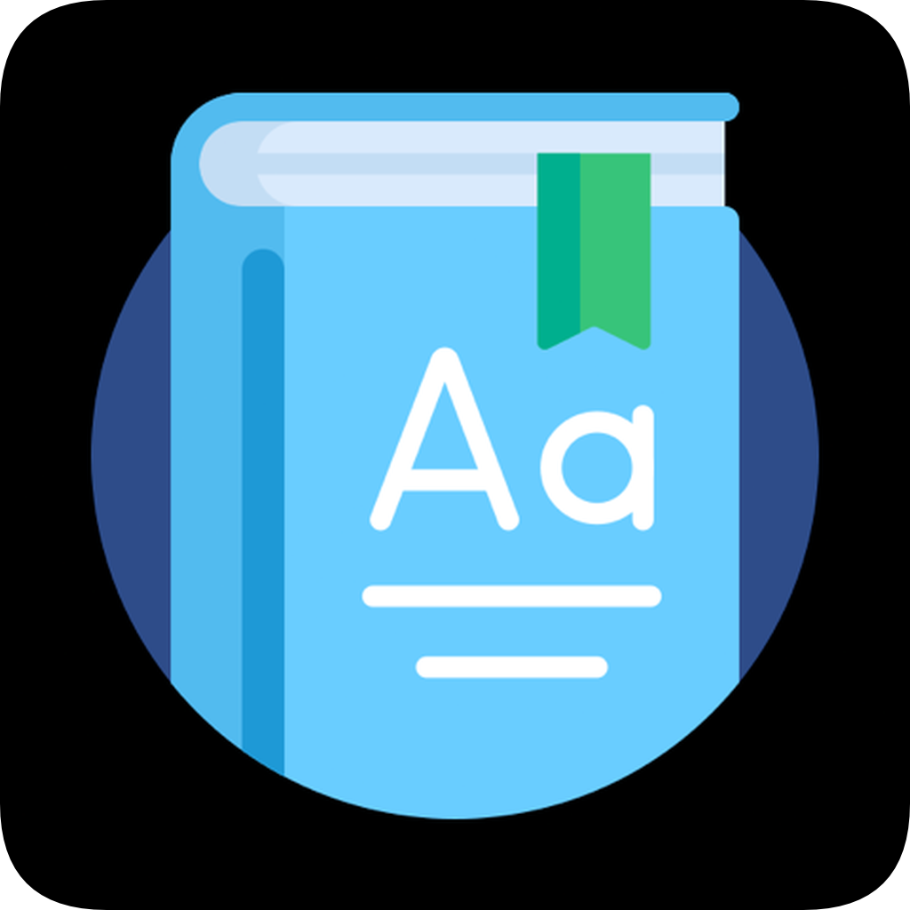
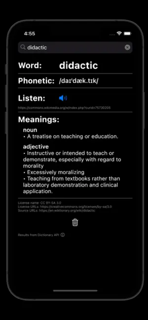
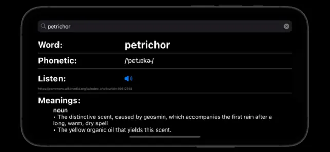
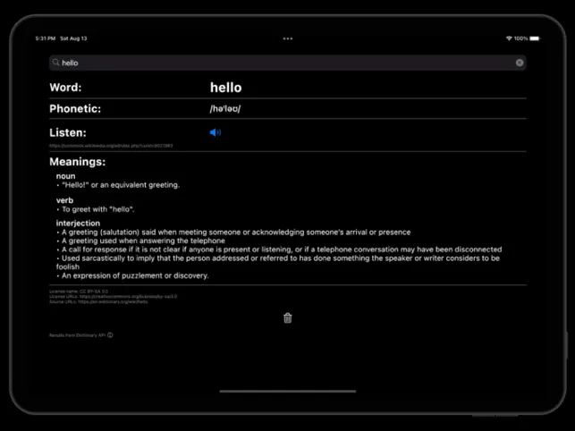

<h1 align="center">
  WordDefiner English Dictionary
   
  
</h1>

  Ad-free English dictionary

# Description

WordDefiner is an open-source online English dictionary app for Android and iOS. It returns the phonetic transcription, pronunciation audio, and meanings based on part of speech for words you look up. The dark, minimalistic design language isn't all that's easy on the eyes: WordDefiner also lacks unnecessary account creation, distracting banners, and annoying ads. Get in and out of your dictionary app in no time with WordDefiner.

     

# Screenshots

    <a href="https://apps.apple.com/app/worddefiner-english-dictionary/id1637774027">
    <a href="https://play.google.com/store/apps/details?id=com.nocturnaldevlab.WordDefiner"> 
     

Credits:

- Definitions from Dictionary API: https://dictionaryapi.dev/
- App icon: Dictionary icons created by Freepik - Flaticon (https://www.flaticon.com/free-icons/dictionary)
